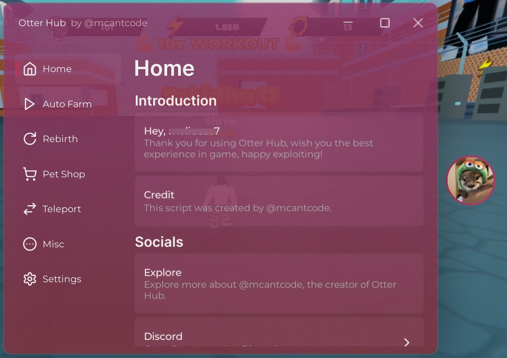

# Otter Hub

A Roblox script hub.

## Showcase

## Features

- Constantly updating to support more games.
- Lightweight, and optimized for performance.
- Using a simple, aesthetic, and easy to use UI library, Fluent.

## Usags

You can directly use Otter Hub by running the [loader.luau](loader.luau) in your Roblox executor.

## License

This project is licensed under the MIT License. See the [LICENSE](LICENSE) file for more details.
